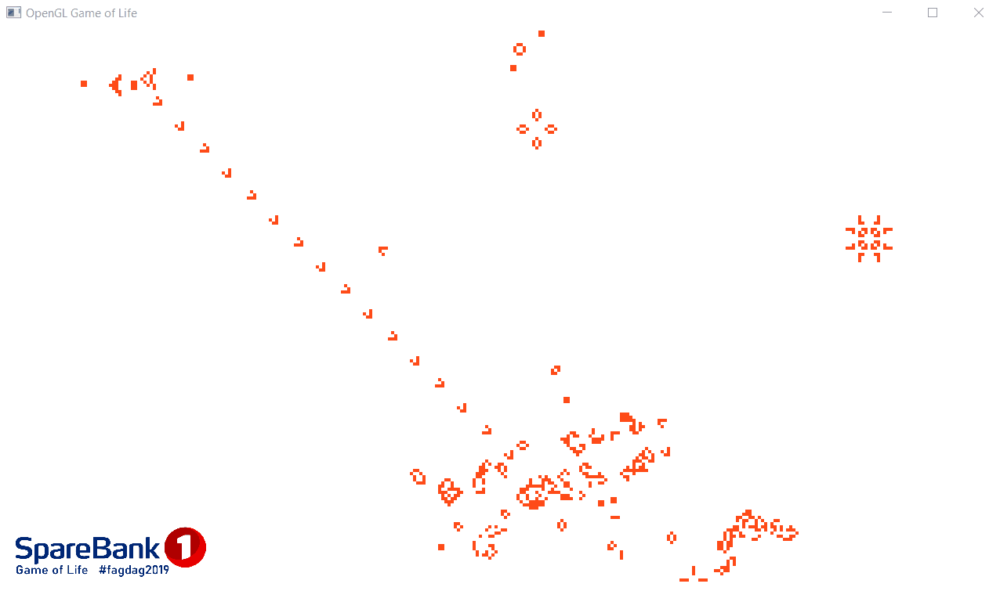

# The Game of Life in OpenGL

Simulates John Conway's "The Game of Life" in an OpenGL fragment shader. 

## How it works
 * Application reads an image with the initial pattern
 * Two render passes
 * First pass renders the new state of the simulation into a framebuffer, using the previous framebuffer output as input
   * Fragment shader samples points around current pixel and writes new state to attached color buffer
 * Then the two framebuffers are swapped
 * Second pass just renders the output texture as fullscreen quad on screen buffer
